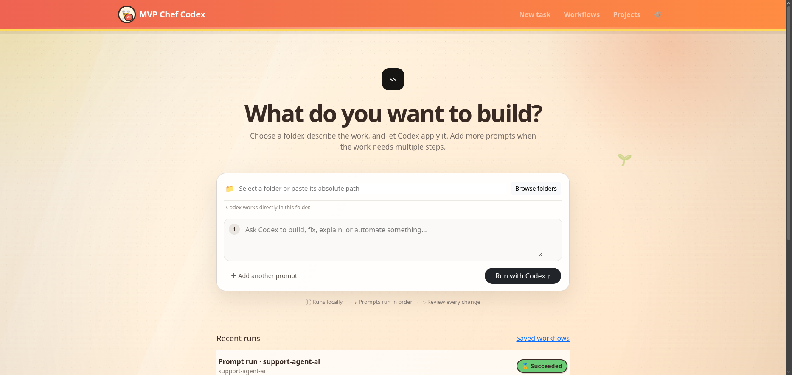

# MVP Chef Codex

MVP Chef Codex is a local web application for turning repeatable Codex CLI work into reusable, versioned recipes. It connects recipes to project folders, runs ordered prompts, streams structured Codex output, records run history in SQLite, and provides approval and recovery controls.

> **Status:** This is an MVP developer tool. Review and test every generated change before relying on it.



## Capabilities

- Compose a quick one-off run from a folder and one or more prompts.
- Create, edit, duplicate, delete, import, and export recipes.
- Associate recipes with local folders, including folders that are not Git repositories.
- Detect common Node.js, Python, and Make project commands.
- Run Codex with `workspace-write`, `read-only`, or `danger-full-access` sandbox settings.
- Stream stdout and stderr to the run detail page with secret redaction.
- Pause, resume, cancel, retry, skip, edit-and-retry, or continue a run.
- Add approval checkpoints before a step, after Codex, or before a local commit.
- Pause on quota limits and optionally resume after a configured cooldown.
- Persist recipes, projects, settings, runs, recovery actions, and locks in SQLite.
- Optionally use local Git checkpoints and commits when a run enables Git behavior.

The run progress bar does not estimate the number of steps. Each structured Codex `item.completed` event advances it by three percentage points, capped at 99% while work is active; a successful run displays 100%.

## Requirements

Install these before running the app locally:

- **Node.js 20 or newer** and **npm**. The project uses the Node engine declared in `package.json` and installs dependencies with npm.
- **Git** for cloning this repository and for optional local checkpoint/commit behavior inside target projects.
- **Codex CLI** for real recipe runs. You can start the web app without it, but Codex-backed runs require an authenticated CLI.
- **Linux** only if you want to use the included systemd deployment scripts. Local development also works anywhere Node.js and the native SQLite dependency can install.

## Quick start: local development

Follow these steps from a terminal.

### 1. Install Node.js and npm

Check your current versions:

```bash
node --version
npm --version
```

If `node` is missing or older than version 20, install Node.js 20 or newer. On Ubuntu/Debian, one option is NodeSource:

```bash
curl -fsSL https://deb.nodesource.com/setup_20.x | sudo -E bash -
sudo apt-get install -y nodejs build-essential
```

On macOS, you can use Homebrew:

```bash
brew install node
```

### 2. Install the Codex CLI

Install Codex CLI using the current OpenAI/Codex installation method for your environment, then verify that the `codex` command is on your `PATH`:

```bash
codex --version
```

Authenticate as the same operating-system user that will run MVP Chef Codex:

```bash
codex login
codex login status
```

A normal signed-in CLI does not need an API key stored in MVP Chef Codex. If your Codex executable is not named `codex` or is not on `PATH`, you can set the command path later in the app's Settings page.

### 3. Clone the repository

```bash
git clone <repository-url>
cd MVP-CHEF-CODEX-AGENT
```

If you already have a checkout, change into it instead.

### 4. Create your environment file

```bash
cp .env.example .env
```

The default file is enough for local development. Edit `.env` if you want to change the port, host, database location, app name, or browser roots.

### 5. Install project dependencies

```bash
npm install
```

This installs Express, EJS, Bootstrap, SQLite support, the test tooling, and the development server dependency.

### 6. Start the development server

```bash
npm run dev
```

Open <http://localhost:3000>. The SQLite database is created automatically at `DATABASE_PATH`; with the example environment this is `./data/mvp-chef-codex.sqlite`.

Use `Ctrl+C` to stop the development server.

### 7. Run the production-style server locally

For a production-style local run, use:

```bash
npm start
```

This runs `node src/server.js` without `nodemon`.

## First run checklist

After opening the app in your browser:

1. Open **Settings**.
2. Confirm the Codex command path. The default is `codex`.
3. Confirm the auth mode, model, approval policy, sandbox, quota cooldown, safe-mode default, and display preferences.
4. Add or select a project folder. If the folder browser is too broad or too narrow, set `PROJECT_BROWSER_ROOTS` in `.env`.
5. Create a quick one-off run or import a recipe.
6. Start with the `workspace-write` sandbox and keep safe mode enabled for risky prompts.
7. Inspect logs and diffs before accepting or committing generated changes.

## Project commands

Run these from the repository root:

```bash
npm run dev      # start the local development server with nodemon
npm start        # start the app with node
npm test         # run Node's built-in test suite
npm run lint     # run ESLint
npm run build    # placeholder build command for deployment checks
```

## Configuration

Copy `.env.example` to `.env`. Supported environment values are:

| Variable | Purpose | Default |
| --- | --- | --- |
| `NODE_ENV` | Runtime environment | `development` |
| `PORT` | HTTP port | `3000` |
| `HOST` | Listen address | `0.0.0.0` in the server when unset |
| `DATABASE_PATH` | SQLite file | `./data/mvp-chef-codex.sqlite` |
| `APP_NAME` | Display name used by the app/environment | `MVP Chef Codex` |
| `PROJECT_BROWSER_ROOTS` | Optional colon-separated roots exposed by the server folder browser | unset |
| `CODEX_RETRY_DELAY_MS` | Delay before retrying a failed Codex prompt step | `300000` (5 minutes) |

Do not commit `.env` or place credentials in recipes. Logs redact values from secret-like environment variables and the target folder's `.env` file.

## Codex setup and app settings

The default executable is `codex`. Authenticate it as the same operating-system user that runs MVP Chef Codex:

```bash
codex login
codex login status
```

The Settings page can select:

- Codex command path
- Auth mode
- Model
- Approval policy
- Sandbox mode
- Quota cooldown and auto-resume behavior
- Safe-mode default
- Display preferences

If you run MVP Chef Codex as a systemd service, run `codex login` for the service user or configure the Settings page with the correct command and auth details for that user.

## Recipe format

Recipe imports use JSON shaped like this:

```json
{
  "name": "Small feature",
  "version": "1.0.0",
  "description": "Implement and verify one focused change.",
  "ingredients": ["Acceptance criteria", "Existing project"],
  "approvalMode": "manual_steps",
  "steps": [
    {
      "title": "Inspect and plan",
      "prompt": "Inspect the project and describe the smallest implementation plan. Do not edit files yet.",
      "requiredChecks": ["Plan names affected files and tests"],
      "maxRetries": 1,
      "requiresApproval": false,
      "approvalOverride": "inherit"
    },
    {
      "title": "Implement and verify",
      "prompt": "Implement the plan, run the relevant test, lint, and build commands, and report exact results.",
      "requiredChecks": ["npm test", "npm run lint", "npm run build"],
      "maxRetries": 2,
      "requiresApproval": true,
      "approvalOverride": "before_commit"
    }
  ]
}
```

Supported recipe approval modes are `manual_steps`, `none`, `before_step`, `after_codex`, `before_commit`, and `all`. Step overrides also accept `inherit`. `requiredChecks` documents verification that the Codex prompt must perform; MVP Chef does not run a second hidden quality-gate process.

The full example at `recipes/demo-node-saas-mvp.json` uses the same fields and approval points as the editor, importer, exporter, and run engine. Built-in templates cover SaaS foundations, landing pages, APIs, authentication, billing, admin dashboards, CRUD, chat, documentation, and test hardening.

## Run lifecycle and safety

1. The app validates the target folder and obtains a per-project run lock.
2. Each recipe step is sent to `codex exec --json` through stdin.
3. Structured output is stored and streamed to the browser.
4. Configured approval points pause execution for a human decision.
5. Failures retain logs and expose retry, prompt editing, skip, continuation, and rollback controls.
6. Terminal states release the project lock.

Use isolated projects for experimentation. Start with `workspace-write`, keep safe mode enabled for risky prompts, inspect diffs and logs, and back up important work before running automation.

## Ubuntu service installation

Use this path when you want MVP Chef Codex to run as a systemd service on Ubuntu.

### 1. Prepare the machine

Make sure you have `sudo` access and that this repository is checked out on the server. The installer will install system packages, Node.js 20 when needed, production npm dependencies, and a systemd service.

### 2. Run the installer

From the repository root:

```bash
sudo ./scripts/install-ubuntu.sh
```

By default, the installer copies the application to `/opt/mvp-chef-codex`, installs production dependencies with `npm ci --omit=dev`, creates `data` and `backups` directories, writes `.env` if needed, enables the service, and waits for `/healthz` to return healthy.

### 3. Optional installer variables

Set variables before the command to customize deployment:

```bash
sudo APP_NAME=mvp-chef-codex SERVICE_NAME=mvp-chef-codex APP_DIR=/opt/mvp-chef-codex APP_USER=ubuntu PORT=3000 ./scripts/install-ubuntu.sh
```

Common variables:

- `APP_NAME`: application directory name default.
- `SERVICE_NAME`: systemd service name.
- `APP_DIR`: installation directory.
- `APP_USER`: operating-system user that owns and runs the app.
- `NODE_MAJOR`: Node.js major version to install when needed; defaults to `20`.
- `PORT`: HTTP port; defaults to `3000`.

### 4. Manage the service

```bash
sudo systemctl status mvp-chef-codex
sudo journalctl -u mvp-chef-codex -f
sudo systemctl restart mvp-chef-codex
```

### 5. Back up and update

```bash
sudo APP_DIR=/opt/mvp-chef-codex ./scripts/backup-db.sh
sudo ./scripts/update.sh
```

You can also create or refresh the unit directly:

```bash
sudo ./scripts/create-systemd-service.sh mvp-chef-codex /opt/mvp-chef-codex ubuntu
```

## Architecture

```text
Browser -> Express routes/controllers -> services -> SQLite
                                  |-> Codex CLI
                                  |-> optional local Git helpers
```

- `src/controllers/`: request handlers
- `src/routes/`: route declarations
- `src/services/`: recipes, projects, runner, state, recovery, validation, and safety
- `src/views/`: server-rendered EJS pages
- `src/public/`: browser JavaScript and CSS
- `src/db.js`: schema migrations and seed data
- `recipes/`: importable examples
- `scripts/`: install, update, service, and backup utilities
- `test/`: route and service regression coverage

## Troubleshooting

- **The app will not start:** run `npm install`, confirm Node.js is version 20 or newer, and check that `PORT` is not already in use.
- **The database cannot be created:** confirm the directory in `DATABASE_PATH` exists or can be created by the app user.
- **Codex is unavailable:** set the correct command path in Settings and run `codex login status` as the same user that runs MVP Chef Codex.
- **A run is locked:** open the active run and resume or cancel it; stale lock leases are cleaned automatically.
- **A run pauses for quota:** wait for the displayed refill time, set a new time, or resume after capacity returns.
- **A prompt is blocked:** safe mode rejects prompt-lint warnings. Rewrite destructive, vague, or secret-exposing instructions.
- **Logs contain redaction markers:** matching credential values were deliberately replaced before persistence.
- **A service update fails:** inspect `journalctl`, confirm `.env` ownership, and restore the newest file from `backups/` if necessary.
